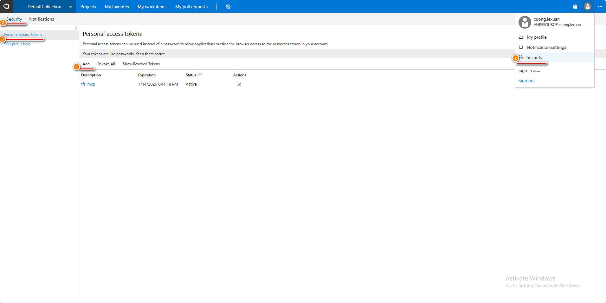

# MCP Servers Guide

This guide explains how to configure the MCP (Model Context Protocol) servers bundled with the VNR Plugin.

## Supported MCP Servers

| Server | Key in `.mcp.json` | Purpose |
|--------|-------------------|---------|
| Team Foundation Server (TFS) | `azureDevOps` | Interact with TFS: repositories, pull requests, pipelines, work items, wikis |
| AMIS Task | `amis-task` | Interact with the AMIS task management system |

---

## Configuration File

All MCP servers are configured in `.mcp.json` at the root of the plugin folder:

```
plugins/vnr-plugin/.mcp.json
```

---

## 1. Team Foundation Server (TFS)

### Configuration

```json
"azureDevOps": {
  "command": "npx",
  "args": ["-y", "@tiberriver256/mcp-server-azure-devops"],
  "env": {
    "AZURE_DEVOPS_ORG_URL": "http://hcm-srv-tfscore01:8080/tfs/DefaultCollection",
    "AZURE_DEVOPS_AUTH_METHOD": "pat",
    "AZURE_DEVOPS_PAT": "your_pat_here",
    "AZURE_DEVOPS_DEFAULT_PROJECT": "VNR.Platform"
  }
}
```

### Parameters

| Variable | Description | Example |
|----------|-------------|---------|
| `AZURE_DEVOPS_ORG_URL` | URL to your TFS organization/collection | `http://hcm-srv-tfscore01:8080/tfs/DefaultCollection` |
| `AZURE_DEVOPS_AUTH_METHOD` | Authentication method — keep as `pat` | `pat` |
| `AZURE_DEVOPS_PAT` | Your Personal Access Token (see steps below) | `abc123...` |
| `AZURE_DEVOPS_DEFAULT_PROJECT` | Default project name used when no project is specified | `VNR.Platform` |

### How to create a Personal Access Token (PAT)

1. Open your TFS in a browser and navigate to:
   ```
   <AZURE_DEVOPS_ORG_URL>/_details/security/tokens
   ```
   Example: `http://hcm-srv-tfscore01:8080/tfs/DefaultCollection/_details/security/tokens`

2. Click **Add** to create a new token.

   

3. Fill in:
   - **Description** — a name for the token (e.g., `tfs_mcp`)
   - **Expiration** — choose a suitable expiry date
   - **Scopes** — grant the required scopes (at minimum: Code Read, Work Items Read & Write)

4. Click **Create Token** and **copy the token value** — it will only be shown once.

5. Paste the token into the `AZURE_DEVOPS_PAT` field in `.mcp.json`.

> **Security note:** Treat your PAT like a password. Do not commit it to source control.

### Changing the default project

Update `AZURE_DEVOPS_DEFAULT_PROJECT` to the project name you work with most often:

```json
"AZURE_DEVOPS_DEFAULT_PROJECT": "YourProjectName"
```

---

## 2. AMIS Task

### Configuration

```json
"amis-task": {
  "type": "stdio",
  "command": "node",
  "args": ["path_to_your_mcp_server\\dist\\src\\index.js"],
  "env": {
    "AMIS_PASSPHRASE": "vnr_team",
    "AMIS_USER_ID": "your_user_id_here"
  }
}
```

### Parameters

| Variable | Description | Example |
|----------|-------------|---------|
| `args[0]` | Absolute path to the compiled AMIS Task MCP server entry point | `C:\\tools\\amis-mcp\\dist\\src\\index.js` |
| `AMIS_PASSPHRASE` | Passphrase used to authenticate with the AMIS system | `vnr_team` |
| `AMIS_USER_ID` | Your AMIS user ID | `cuong.lexuan` |

### Setup steps

1. Obtain the AMIS Task MCP server package from your team lead or the internal tools repository.
2. Build or extract the package so that the `dist/src/index.js` file is available.
3. Replace `path_to_your_mcp_server` in `args` with the **absolute path** to the folder containing the server:

   ```json
   "args": ["C:\\tools\\amis-mcp\\dist\\src\\index.js"]
   ```

4. Set `AMIS_PASSPHRASE` to the passphrase provided by your team (default for VNR team: `vnr_team`).
5. Set `AMIS_USER_ID` to your personal AMIS user ID (e.g., your login name or employee code).

---

## Final `.mcp.json` example

```json
{
  "mcpServers": {
    "azureDevOps": {
      "command": "npx",
      "args": ["-y", "@tiberriver256/mcp-server-azure-devops"],
      "env": {
        "AZURE_DEVOPS_ORG_URL": "http://hcm-srv-tfscore01:8080/tfs/DefaultCollection",
        "AZURE_DEVOPS_AUTH_METHOD": "pat",
        "AZURE_DEVOPS_PAT": "paste_your_pat_here",
        "AZURE_DEVOPS_DEFAULT_PROJECT": "VNR.Platform"
      }
    },
    "amis-task": {
      "type": "stdio",
      "command": "node",
      "args": ["C:\\tools\\amis-mcp\\dist\\src\\index.js"],
      "env": {
        "AMIS_PASSPHRASE": "vnr_team",
        "AMIS_USER_ID": "your_user_id_here"
      }
    }
  }
}
```
