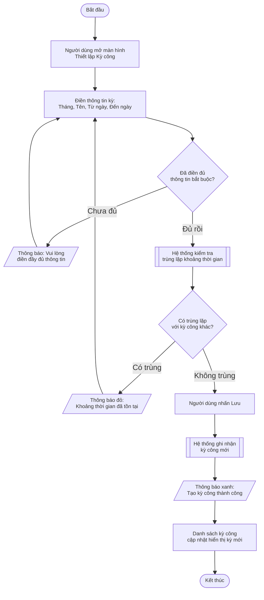

# Step 04 — Vẽ Activity Diagram

## Mục tiêu

Tạo Activity Diagram bằng Mermaid `flowchart TD` thể hiện toàn bộ luồng nghiệp vụ của US, bao gồm tất cả happy path, sad path, và edge cases đã được định nghĩa trong AC ở Step 03.

---

## Quy tắc bắt buộc

### Quy tắc kỹ thuật Mermaid:
1. **Chỉ dùng `flowchart TD`** — không dùng `graph TD`, `sequenceDiagram`, `stateDiagram`, hay bất kỳ loại chart nào khác.
2. **Không dùng swimlane** — diagram chỉ có 1 actor (người dùng đã được chọn), không chia subgraph theo vai trò.
3. **Luôn thêm dòng classDef** ngay sau khai báo `flowchart TD`:
   ```
   classDef default font-size:11px,line-height:1.2
   ```
4. **Nhãn cạnh (edge label)** phải ngắn — tối đa 5-6 từ.
5. **ID node** phải ngắn, không có dấu cách: `A`, `B`, `C1`, `DK1`, v.v.

### Ký hiệu node bắt buộc:

| Loại node | Ký hiệu Mermaid | Dùng khi |
|---|---|---|
| Điểm bắt đầu | `A([Bắt đầu])` | Điểm khởi đầu duy nhất của diagram |
| Điểm kết thúc | `Z([Kết thúc])` | Có thể có nhiều điểm kết thúc |
| Hành động người dùng | `B[Nhập thông tin kỳ công]` | Người dùng làm gì |
| Quyết định / Điều kiện | `C{Ngày trùng lặp?}` | Rẽ nhánh Yes/No hoặc điều kiện |
| Phản hồi hệ thống | `D[/Thông báo thành công/]` | Thông báo, hiển thị, cảnh báo |
| Xử lý hệ thống | `E[[Hệ thống kiểm tra]]` | Hệ thống tự động xử lý |

**Ghi nhớ ký hiệu:**
- `[...]` = hành động thông thường (vuông)
- `{...}` = quyết định / điều kiện (thoi)
- `([...])` = bắt đầu / kết thúc (hình trứng)
- `[/..../]` = thông báo / notification (bình hành)
- `[[...]]` = xử lý tự động của hệ thống (vuông kép)

---

## Hành động 1: Phân tích AC để xác định các nhánh cần vẽ

Dựa trên AC đã approve ở Step 03, liệt kê các nhánh chính:

```
Phân tích luồng từ [N] AC:

Luồng chính (happy path):
  → [AC-001] → [AC-002] → ...

Nhánh rẽ (sad path / validation):
  → [AC-003]: Nhánh khi [điều kiện lỗi]
  → [AC-004]: Nhánh khi [thiếu thông tin]

Nhánh đặc biệt (edge cases):
  → [AC-005]: Nhánh khi [điều kiện EC]
  → [AC-006]: Nhánh khi [điều kiện EC khác]
```

Mỗi AC phải được cover bởi ít nhất một nhánh trong diagram.

---

## Hành động 2: Phác thảo cấu trúc diagram trước khi viết

Trước khi viết Mermaid code, phác thảo dạng text:

```
BẮT ĐẦU
  ↓
[Người dùng mở màn hình X]
  ↓
[Người dùng điền thông tin]
  ↓
{Thông tin đầy đủ?}
  ├─ Không → [/Thông báo lỗi thiếu thông tin/] → [Người dùng điền lại] (loop)
  └─ Có ↓
{Dữ liệu trùng lặp?}
  ├─ Có → [/Cảnh báo trùng lặp/] → KẾT THÚC (thất bại)
  └─ Không ↓
[Hệ thống lưu thông tin]
  ↓
[/Thông báo thành công/]
  ↓
KẾT THÚC (thành công)
```

---

## Hành động 3: Viết Mermaid diagram

Viết code Mermaid hoàn chỉnh trong code block:

````markdown

````

---

## Hành động 4: Validate diagram — Kiểm tra bắt buộc

Sau khi viết xong diagram, tự kiểm tra theo checklist:

**Kiểm tra tính đầy đủ:**
- [ ] Có đúng 1 node bắt đầu `([Bắt đầu])`
- [ ] Tất cả nhánh đều có điểm kết thúc `([Kết thúc])` (không có nhánh "đứt")
- [ ] Mỗi AC đã approve có ít nhất 1 nhánh tương ứng trong diagram

**Kiểm tra ký hiệu:**
- [ ] Điểm bắt đầu/kết thúc dùng `([...])`
- [ ] Quyết định dùng `{...}`
- [ ] Hành động thông thường dùng `[...]`
- [ ] Thông báo/phản hồi dùng `[/..../]`
- [ ] Xử lý tự động của hệ thống dùng `[[...]]`

**Kiểm tra ngôn ngữ:**
- [ ] Không có từ kỹ thuật trong label của bất kỳ node nào
- [ ] Không có: API, endpoint, response, database, null, error code
- [ ] Ngôn ngữ thuần nghiệp vụ: "Thông báo", "Cảnh báo", "Lưu", "Hủy"

**Kiểm tra ký pháp Mermaid:**
- [ ] `classDef default font-size:11px,line-height:1.2` đã thêm
- [ ] Không có ký tự đặc biệt gây lỗi (tránh dùng `:`, `"` trong label — dùng `\n` để xuống dòng)
- [ ] ID node không trùng nhau

**Nếu fail kiểm tra:** Sửa và tự kiểm tra lại trước khi trình BA.

---

## Hành động 5: Trình BA review diagram

```
--- ACTIVITY DIAGRAM (Draft) ---

[Mermaid code block]

Diagram cover [N] AC scenarios:
✓ AC-001: Happy path — [node A → B → ... → Z]
✓ AC-002: Sad path — [node A → ... → H → ...]
✓ AC-003: Edge case — [node ... → G → ...]

BA có muốn chỉnh sửa diagram không?
- Thêm nhánh: [mô tả]
- Đơn giản hóa: [nhánh nào]
- Điều chỉnh nhãn: [node nào]
```

Điều chỉnh theo góp ý BA và tự validate lại trước khi kết thúc step.

---

## Kết quả đầu ra Step 04

Diagram Mermaid đã được BA approve, đảm bảo:
- Cover 100% AC đã định nghĩa ở Step 03
- Đúng ký hiệu notation
- Không có từ kỹ thuật
- Mermaid code hợp lệ

---

## Chuyển sang Step tiếp theo

Đọc và thực thi: `./steps/step-05-write-data-business-rules.md`
