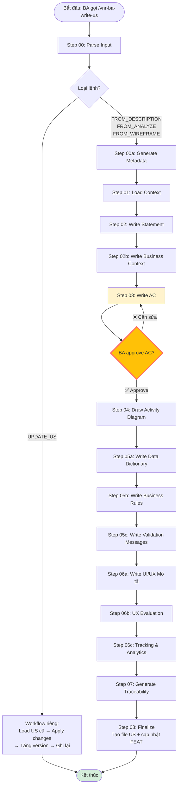

# Skill: vnr-ba-write-us — Tạo User Story theo chuẩn BA

## 📌 Tổng Quan

Skill **vnr-ba-write-us** tự động hóa quy trình viết User Story (US) từ Actor-Task Matrix của FEAT cha, đạt chuẩn **100% nghiệp vụ, ZERO kỹ thuật**.

**Tự động hóa:** 95% — BA chỉ cần approve Acceptance Criteria (Step 03)  
**Output:** File US hoàn chỉnh với 11 phần, sẵn sàng chuyển cho Dev

---

## 🎯 Khi Nào Dùng Skill Này?

✅ **Dùng khi:**
- Cần viết US mới từ mô tả nghiệp vụ (KHÔNG bắt buộc phải có FEAT ID trước)
- Đã có kết quả analyze và muốn viết US từ đó
- Có wireframe/mockup và muốn trích xuất US từ UI
- Muốn cập nhật US hiện có (tăng version)
- Muốn US có đầy đủ: AC, Diagram, Data Dictionary, BR, VM, UI/UX, Traceability

❌ **KHÔNG dùng khi:**
- Cần viết FEAT hoặc EPIC → Dùng `/ba-feat` hoặc `/ba-epic`
- Cần review US đã viết → Dùng `/ba-us-check`
- Cần làm sâu thêm US → Dùng `/ba-us-refine`

---

## 🚀 Cách Sử Dụng

### 📐 4 Loại Lệnh Linh Hoạt

Skill hỗ trợ 4 loại lệnh - **KHÔNG bắt buộc phải có FEAT ID trước:**

#### 1️⃣ Viết US từ mô tả nghiệp vụ tự do

```
write us HR Admin tạo ca làm việc mới
```

Hoặc:

```
Tôi muốn viết US cho chức năng HR Admin tạo ca làm việc mới, 
ca này có tên, giờ bắt đầu, giờ kết thúc
```

**Khi dùng:**
- Bạn chưa có FEAT ID
- Muốn bắt đầu nhanh từ ý tưởng nghiệp vụ
- Skill sẽ tự động phân tích Actor, Task, Context từ mô tả

---

#### 2️⃣ Viết US từ kết quả analyze

```
write us from analyze ANALYZE-ATT-001
```

**Khi dùng:**
- Đã chạy skill `/ba-analyze` hoặc có file kết quả analyze
- Muốn tái sử dụng Actor-Task Matrix đã phân tích
- Skill sẽ load file analyze và extract thông tin

---

#### 3️⃣ Viết US từ wireframe/mockup 🆕

```
write us from wireframe https://figma.com/file/xyz
```

Hoặc:

```
write us from wireframe D:\Screenshots\screen-login.png
```

**Khi dùng:**
- Có wireframe/mockup sẵn
- Muốn trích xuất Actor-Task từ UI elements
- Skill sẽ gọi `/ba-wireframe` để phân tích UI trước

---

#### 4️⃣ Cập nhật US hiện có

```
update us ATT-E01-F02-U003 thêm validation cho trường Tên ca
```

**Khi dùng:**
- US đã tồn tại và cần chỉnh sửa
- Muốn tracking version (1.0 → 1.1)
- Skill sẽ load US cũ, apply changes, tăng version, ghi Change Log

**Lưu ý:** Lệnh này có workflow riêng (KHÔNG chạy qua 10 steps đầy đủ)

---

### ⚡ Trigger Keywords

Skill tự động kích hoạt khi gặp:
- `ba us`, `tạo user story`, `viết us`, `write us`
- `update us`, `cập nhật us`
- `from analyze`, `from wireframe`

---

### 🔄 Quy Trình 10 Steps

| Step | Nội dung | Chuyển tiếp | BA Confirm? |
|------|----------|-------------|-------------|
| 00 | **Parse Input** - Phân loại 4 loại lệnh + extract thông tin | → 00a | ❌ Tự động |
| 00a | Generate Metadata (US ID, Version, Status) | → 01 | ❌ Tự động |
| 01 | Load context (FEAT + EPIC + Ground Rules + Edge Cases) | → 02 | ❌ Tự động |
| 02 | Write Statement (Là/Tôi muốn/Để) + Out of Scope + Segments | → 02b | ❌ Tự động |
| 02b | Write Mô tả nghiệp vụ (Bối cảnh, Master-Detail, Ví dụ, Thuật ngữ) | → 03 | ❌ Tự động |
| 03 | Write Acceptance Criteria (Given/When/Then) | → 04 | ✅ **BA approve AC** |
| 04 | Draw Activity Diagram (Mermaid flowchart TD) | → 05a | ❌ Tự động |
| 05a | Write Data Dictionary (Trường, Kiểu nghiệp vụ, Bắt buộc, Ràng buộc) | → 05b | ❌ Tự động |
| 05b | Write Business Rules (BR-U trace về BR-F, 5 loại, Gợi ý tương lai) | → 05c | ❌ Tự động |
| 05c | Write Validation Messages (Error/Warning/Success/Info) + Ma trận VM↔BR↔AC | → 06a | ❌ Tự động |
| 06a | Write UI/UX Mô tả (Màn hình, Trạng thái, Luồng điều hướng) | → 06b | ❌ Tự động |
| 06b | UX Evaluation (6 tiêu chí: Completeness, States, Feedback, Error Prevention, Consistency, Wireframe) | → 06c | ❌ Tự động |
| 06c | Tracking & Analytics (Audit Trail + Analytics Events) | → 07 | ❌ Tự động |
| 07 | Generate Traceability Matrices (AC↔BR, VM↔BR↔AC, Dependencies) | → 08 | ❌ Tự động |
| 08 | Tạo file US (11 phần) + cập nhật FEAT.md | END | ❌ Tự động |

**Checkpoint duy nhất:** BA approve Acceptance Criteria ở Step 03

**Lưu ý:** 
- Step 00 (Parse Input) là bước mới - phân loại lệnh trước khi vào workflow chính
- Lệnh `update us` không chạy 10 steps này, có workflow riêng biệt

---

## 📄 Output: File US 11 Phần

File US hoàn chỉnh bao gồm:

0. 📌 **Metadata** (US ID, Version, Status, Author, Epic, FEAT, Actor, Priority, Segments)
1. 📝 **User Story Statement** (Là/Tôi muốn/Để + Trace FAC + Out of Scope)
2. 📖 **Mô Tả Nghiệp Vụ** (Bối cảnh, Master-Detail, Ví dụ, Thuật ngữ)
3. ⚙️ **Business Rules** (BR-U trace về BR-F, Gợi ý tương lai)
4. ✅ **Acceptance Criteria** (Given/When/Then + Trace FAC)
5. 📊 **Activity Diagram** (Mermaid flowchart TD)
6. 🗂️ **Data Dictionary** (Trường, Kiểu nghiệp vụ, Bắt buộc, Ràng buộc)
7. 📝 **Validation Messages** (Error/Warning/Success/Info + Quy ước hiển thị + Ma trận VM↔BR↔AC)
8. 📱 **UI/UX Mô tả** (Màn hình, 4 trạng thái, Luồng điều hướng, UX Evaluation)
9. 📈 **Tracking & Analytics** (Audit Trail + Analytics Events)
10. 🔗 **Traceability** (Ma trận AC↔BR, VM↔BR↔AC, Dependencies)
11. 📌 **Change Log** (Version history)

**Đường dẫn file:**  
`Module/{MOD}/Epics/{EPIC}/Features/{FEAT}/Stories/{US-ID}_{US-Name}.md`

---

## ✅ Nguyên Tắc "Zero Kỹ Thuật"

Skill tự động quét và loại bỏ **mọi từ kỹ thuật** trước khi ghi file:

**Từ cấm:**
```
API, endpoint, HTTP, GET, POST, PUT, DELETE,
database, DB, table, column, schema,
component, interface, DTO, Command, Query, Handler,
Service, Controller, Repository, Entity,
async, await, token, JWT, payload,
string, integer, boolean, null, array, enum,
varchar, int, bigint, decimal, float
```

**Thay bằng từ nghiệp vụ:**
- `varchar(100)` → `Văn bản (tối đa 100 ký tự)`
- `boolean` → `Checkbox (Có/Không)`
- `nullable` → `Không bắt buộc`
- `POST /api/pay-periods` → `Hệ thống ghi nhận kỳ công mới`

---

## 🎓 Ví Dụ Workflow

### Ví dụ 1: Viết US từ mô tả tự do

#### Input
```
write us HR Admin tạo ca làm việc mới
```

#### Step 00 — Parse Input
```
✓ DETECTED: FROM_DESCRIPTION
- Actor: HR Admin
- Task: Tạo ca làm việc mới
- Context: Để quản lý lịch làm việc của nhân viên

→ Chuyển sang Step 00a (Generate Metadata)
```

#### Step 03 — BA Approve AC (Checkpoint duy nhất)
```
--- ACCEPTANCE CRITERIA (Draft) ---

AC-001: Tạo thành công với đầy đủ thông tin
Given: HR Admin đang ở màn hình Quản lý Ca làm việc
When: HR Admin điền Tên ca, Giờ bắt đầu, Giờ kết thúc và nhấn Lưu
Then: Hệ thống ghi nhận ca mới và hiển thị thông báo "Ca làm việc X đã được tạo thành công"

AC-002: Không cho phép khoảng thời gian trùng lặp
...

Tổng: 5 AC scenarios
- Happy path: 2 scenarios
- Sad path: 2 scenarios
- Edge cases: 1 scenario

BA có muốn chỉnh sửa AC nào không?
```

BA approve → Skill chạy tiếp tự động Step 04-08

#### Output
```
✅ User Story hoàn thành!

📄 File tạo mới:
   Module/ATT/Epics/ATT-E02_.../Features/ATT-E02-F01_.../Stories/ATT-E02-F01-U003_Tao_Ca_Lam_Viec.md

📋 Tóm tắt:
   ID:     ATT-E02-F01-U003
   Actor:  HR Admin
   Status: Draft
   ACs:    5 criteria
   BRs:    4 rules

🔗 Đã cập nhật FEAT cha:
   ATT-E02-F01 — us_count: 2 → 3
```

---

### Ví dụ 2: Update US hiện có

#### Input
```
update us ATT-E01-F02-U003 thêm validation cho trường Tên ca: 
- Không được để trống
- Tối đa 100 ký tự
- Không được trùng với ca đã tồn tại
```

#### Output (Workflow riêng - không qua 10 steps)
```
✓ DETECTED: UPDATE_US
- US ID: ATT-E01-F02-U003
- Thay đổi: Thêm validation cho trường Tên ca

→ Load US cũ... OK
→ Version hiện tại: 1.0
→ Apply changes...
   - Section 5 (Data Dictionary): Cập nhật trường "Tên ca"
   - Section 6 (Business Rules): Thêm BR-U-004, BR-U-005, BR-U-006
   - Section 7 (Validation Messages): Thêm VM-E-004, VM-E-005
   - Section 10 (Traceability): Cập nhật ma trận
   - Section 11 (Change Log): Thêm entry mới
→ Tăng version: 1.0 → 1.1
→ Ghi file... OK

✅ Đã cập nhật US!

📄 File: ATT-E01-F02-U003_Tao_Ca_Lam_Viec.md
📌 Version: 1.0 → 1.1
🔖 Thay đổi: Thêm 3 BR + 2 VM cho validation Tên ca
```

---

### Ví dụ 3: Viết US từ wireframe

#### Input
```
write us from wireframe https://figma.com/file/xyz
```

#### Step 00 — Parse Input
```
✓ DETECTED: FROM_WIREFRAME
- Wireframe URL: https://figma.com/file/xyz

⚠️  Cần gọi skill `ba-wireframe` trước để phân tích UI

Tôi sẽ gọi skill `ba-wireframe` để:
1. Phân tích wireframe/mockup
2. Trích xuất Actor-Task từ UI elements
3. Nhận diện business context từ screen layout

Bạn có muốn tôi gọi `ba-wireframe` ngay không?
```

BA confirm → Gọi `/ba-wireframe` → Nhận kết quả → Chuyển sang Step 00a

---

## 🔍 Features Nổi Bật

### 1. Tự động phát hiện Edge Cases
- Load Edge Case Library từ `_product/edge-cases/`
- Phân tích tự động EC nào liên quan (khớp domain/actor/hành động/FAC)
- Tạo AC cho từng EC đã chọn

### 2. Validation Messages đầy đủ
- Phân loại 4 loại: Error / Warning / Success / Info
- Quy ước hiển thị chuẩn (Vị trí / Thời gian / Màu sắc)
- Quy ước tham số: `{fieldName}`, `{entityName}`, `{value}`, `{count}`, v.v.
- Ma trận VM ↔ BR ↔ AC để trace nguồn gốc

### 3. UX Evaluation tự động
- 6 tiêu chí: Completeness, State Coverage, Feedback, Error Prevention, Consistency, Wireframe Coverage
- Báo cáo PASS ✅ / CẦN BỔ SUNG ⚠️
- Kiểm tra 4 trạng thái UI: Loading / Data / Empty / Error

### 4. Traceability đầy đủ
- AC → FAC (từ FEAT cha)
- BR-U → BR-F (Specialise hoặc Kế thừa)
- VM → BR + AC (ma trận 3 chiều)
- US → FEAT → EPIC (dependencies)

### 5. Segment Support
- Tự động xác định AC nào liên quan đến segment
- Logic: AC có nhắc "thời gian", "kỳ công", "tính lương", "thưởng" → thêm segment note
- Ghi rõ đặc thù cho từng segment

---

## 📁 Cấu Trúc Thư Mục

```
.claude/skills/vnr-ba-write-us/
├── README.md                # Tài liệu này
├── workflows/
│   ├── main-workflow.md     # Quy trình chính 15 steps + 4 lệnh
│   └── update-us-workflow.md # Workflow UPDATE_US (Smart Patch)
├── steps/
│   ├── step-00-parse-input.md        # 🆕 Phân loại 4 loại lệnh
│   ├── step-00-generate-metadata.md  # (rename step-00a)
│   ├── step-01-load-context.md
│   ├── step-02-write-statement.md
│   ├── step-02b-write-business-context.md
│   ├── step-03-write-ac.md
│   ├── step-04-draw-activity-diagram.md
│   ├── step-05a-write-data-dictionary.md
│   ├── step-05b-write-business-rules.md
│   ├── step-05c-write-validation-messages.md
│   ├── step-06a-write-uiux-description.md
│   ├── step-06b-ux-evaluation.md
│   ├── step-06c-tracking-analytics.md
│   ├── step-07-generate-traceability.md
│   └── step-08-finalize.md
└── templates/
    └── us-template.md       # Template US 11 phần
```

---

## 🔗 Skills Liên Quan

| Skill | Dùng khi |
|-------|----------|
| `/ba-feat` | Tạo FEAT cha trước khi viết US |
| `/ba-us-check` | Validate US đạt chuẩn "Ready for PBI" |
| `/ba-us-refine` | Làm sâu thêm US khi còn thiếu |
| `/ba-pbi-compose` | Map US (BA) → PBI (Dev) |
| `/ba-wireframe` | Phân tích wireframe để bổ sung UI/UX |

---

## 📊 Thống Kê

- **Số steps:** 15 (00, 00a, 01, 02, 02b, 03, 04, 05a/b/c, 06a/b/c, 07, 08)
- **Số lệnh hỗ trợ:** 4 (`write us [mô tả]`, `from analyze`, `from wireframe`, `update us`)
- **Checkpoint:** 1 (BA approve AC ở Step 03)
- **Tự động hóa:** 95%
- **Thời gian:** ~5-10 phút (tùy độ phức tạp của US)
- **Output:** 11 phần, ~400-600 dòng markdown

---

## ❓ Troubleshooting

### Skill báo "FEAT không có Actor-Task Matrix"
**Giải pháp:**
1. Mở file FEAT cha
2. Kiểm tra có section "Actor-Task Matrix" không
3. Nếu chưa có → Chạy `/ba-feat` để tạo lại FEAT hoặc thêm Matrix thủ công

### Skill không tìm thấy Edge Case Library
**Giải pháp:**
- Không phải lỗi nghiêm trọng
- Skill sẽ tự tạo edge cases phổ biến dựa trên domain
- Nếu cần: tạo `_product/edge-cases/_index.md`

### AC bị duplicate hoặc thiếu
**Giải pháp:**
- Ở Step 03, BA có thể yêu cầu thêm/sửa/xóa AC trước khi approve
- Sau khi approve, nếu cần sửa → Dùng `/ba-us-refine`

---

## 📊 Sơ Đồ Luồng Workflow



---

## 📝 Change Log

| Version | Date | Changes |
|---------|------|---------|
| 3.3 | 2026-04-17 | ✅ Split Step 05 (526 dòng) thành 2 steps:<br/>- Step 05a: Write Data Dictionary (~120 dòng)<br/>- Step 05b: Write Business Rules (~400 dòng)<br/>✅ Cập nhật workflow table và Mermaid diagram<br/>✅ **Tổng cộng đã split: Step 05 (2 sub-steps) + Step 06 (3 sub-steps)** |
| 3.2 | 2026-04-17 | ✅ Split Step 06 (647 dòng) thành 3 steps nhỏ hơn:<br/>- Step 06a: Write UI/UX Mô tả (~300 dòng)<br/>- Step 06b: UX Evaluation (~100 dòng)<br/>- Step 06c: Tracking & Analytics (~150 dòng)<br/>✅ Cập nhật workflow table và Mermaid diagram |
| 3.1 | 2026-04-17 | ✅ Sửa luồng chuyển step:<br/>- Step 00a → 01 (fix typo `sstep-00-parse-input`)<br/>- Step 00 → 00a (rõ ràng hóa)<br/>- Step 02 → 02b (thêm step bị bỏ qua)<br/>- Step 05 → 05c (thêm step bị bỏ qua)<br/>✅ Thêm cột "Chuyển tiếp" vào bảng workflow<br/>✅ Thêm Mermaid diagram workflow |
| 3.0 | 2026-04-16 | ✅ Thêm Step 00: Parse Input — hỗ trợ 4 loại lệnh<br>✅ `write us [mô tả]` — viết US từ mô tả tự do<br>✅ `write us from analyze [ID]` — từ kết quả analyze<br>✅ `write us from wireframe [URL]` — từ wireframe/mockup 🆕<br>✅ `update us [US_ID] [thay đổi]` — cập nhật US hiện có<br>✅ KHÔNG bắt buộc FEAT ID trước |
| 2.0 | 2026-04-16 | ✅ Sửa duplicate content (step-05c, step-07)<br>✅ Bổ sung logic Segment (step-03)<br>✅ Bổ sung logic Blocks detection (step-07)<br>✅ Thêm quy ước tham số VM (step-05c)<br>✅ Sửa link step (step-06) |
| 1.0 | 2026-04-15 | 🎉 Initial version — 9 steps, 11 phần, 95% tự động hóa |

---

**Liên hệ:** Nếu có vấn đề hoặc góp ý, tạo issue trong repo hoặc liên hệ BA Team.
